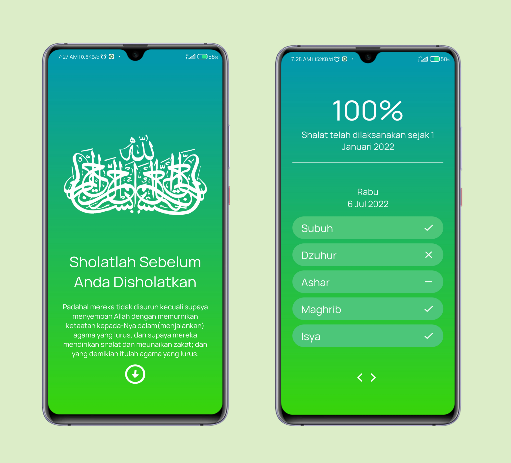

<strong>Shalat Reminder Native Android Application</strong>

### About
Shalat Reminder - adalah sebuah aplikasi yang dibangun untuk memenuhi project UAS pada mata kuliah <strong>Pemrograman Mobile Teori 2022</strong>

### Features
- [x] Random hadits
- [x] Autoplay adzan
- [x] Indonesia date format
- [x] Dynamic options

### Technology & Tools
- [x] Java
- [x] Android Studio IDE
- [x] PicSay Pro
- [x] Color Picker
- [x] Git

### Support Me
Support me with a cup of coffee and other snacks [here ..](https://saweria.co/orabdillh)  
Don't forget to give me star in this repository 🙏🏻🙏🏻  
See my other projects on instagram [@or.abdillh](http://www.instagram.com/or.abdillh)  

[Oka R Abdillah ](http://github.com/or-abdillh)
 
Last edited on : 06/07/2022
